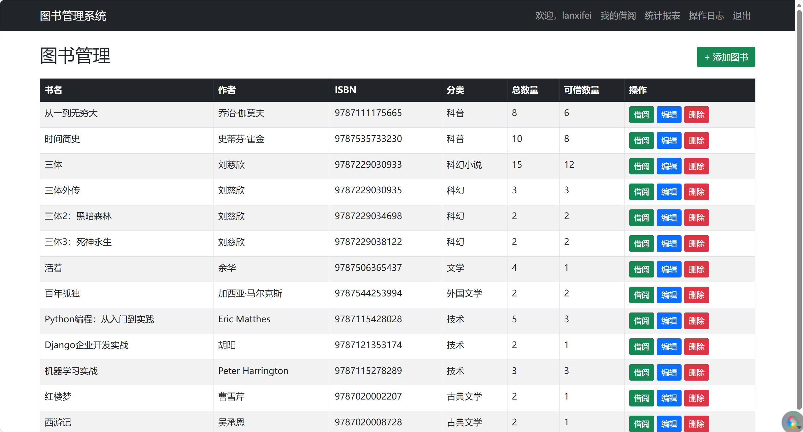
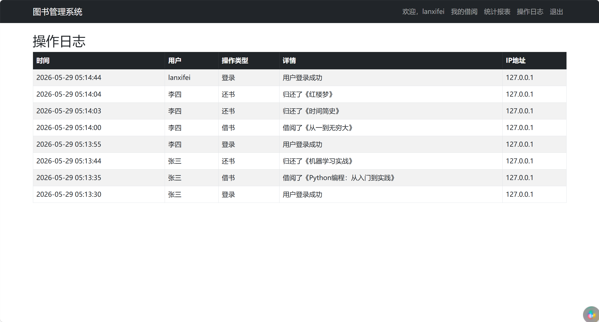
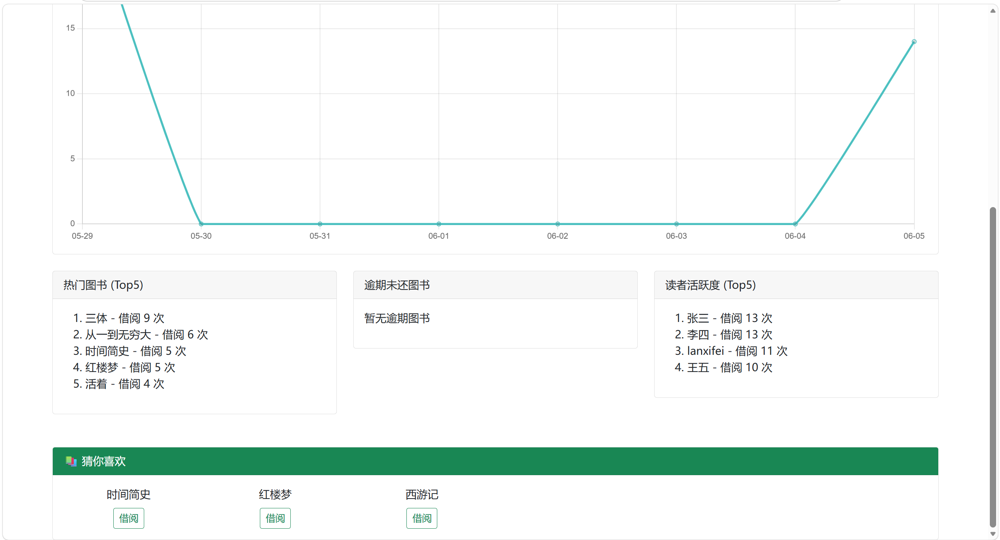
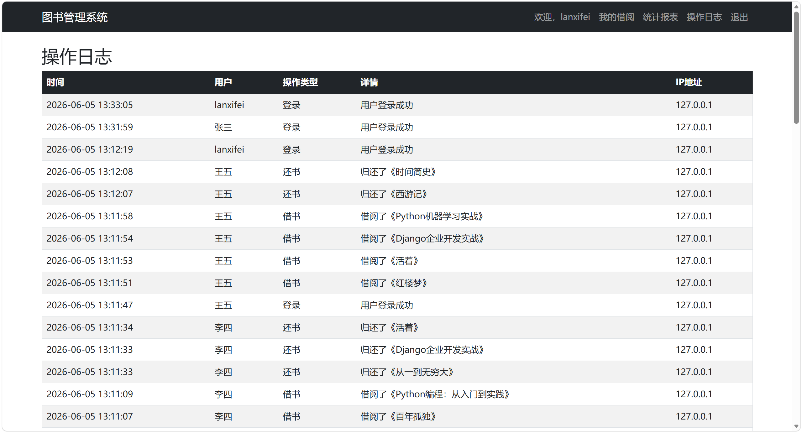

# 图书推荐管理系统

## 项目简介
这是一个基于 Django 框架开发的图书推荐管理系统。实现了图书在线管理、借阅归还、借阅数据可视化展示以及基于协同过滤的图书推荐模块。

## 技术栈
- 后端：Python, Django
- 数据库：MySQL（也可使用 SQLite）
- 前端：HTML, Bootstrap, Chart.js
- 推荐算法：基于用户的协同过滤（余弦相似度）

## 项目亮点
- 基于用户的协同过滤推荐，根据借阅历史推荐图书。
- 使用 Chart.js 展示近7天借阅趋势图。
- 区分普通用户与管理员权限，管理员可管理图书、查看操作日志。
- 提供热门图书排行、读者活跃度排行、逾期未还列表等统计功能。
- 操作日志审计，记录关键操作及 IP 地址。

## 如何运行

### 环境准备
- Python 3.9+
- pip
- MySQL（可选，也可使用 SQLite）

### 运行步骤

1. 克隆项目
   ```bash
   git clone https://github.com/Guzedegithub/LibrarySystem.git
   cd LibrarySystem
2. 创建并激活虚拟环境（Windows）
   ```bash
   python -m venv venv
   venv\Scripts\activate
3. 安装依赖
   ```bash
   pip install -r requirements.txt
4. 配置数据库
 - 若使用 MySQL：创建数据库 library_db，并在 LibraryProject/local_settings.py 中填写数据库配置。
 - 若使用 SQLite：修改 settings.py，将 DATABASES 改为 SQLite 配置。
5. 执行数据库迁移
   ```bash
   python manage.py makemigrations
   python manage.py migrate
6. 创建管理员账户
   ```bash
   python manage.py createsuperuser
7. 启动开发服务器
   ```bash
   python manage.py runserver
8. 访问系统
 - 打开浏览器访问 http://127.0.0.1:8000/books/

## 项目截图





# 作者
- 兰希飞
- lanxifei1295566977@qq.com
